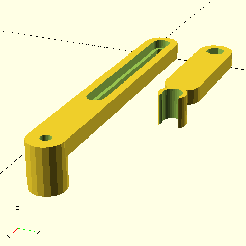
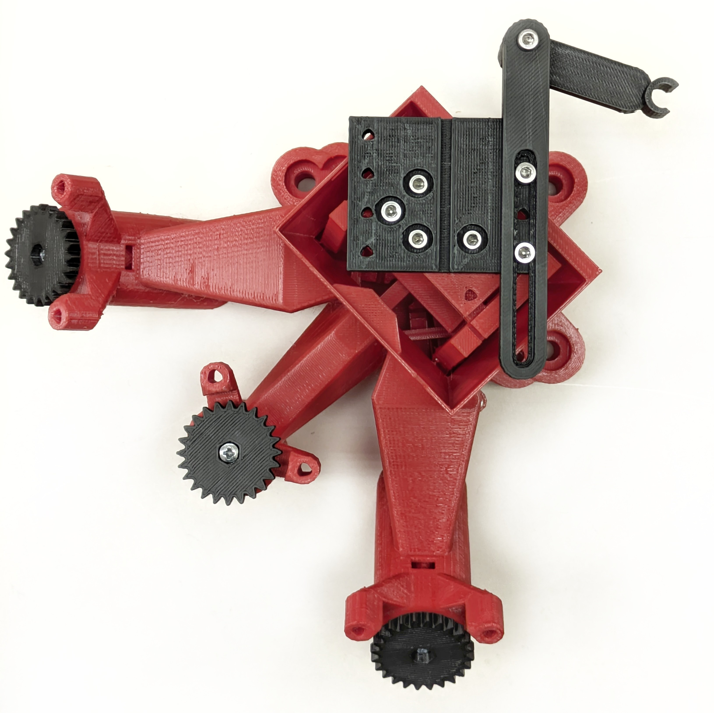
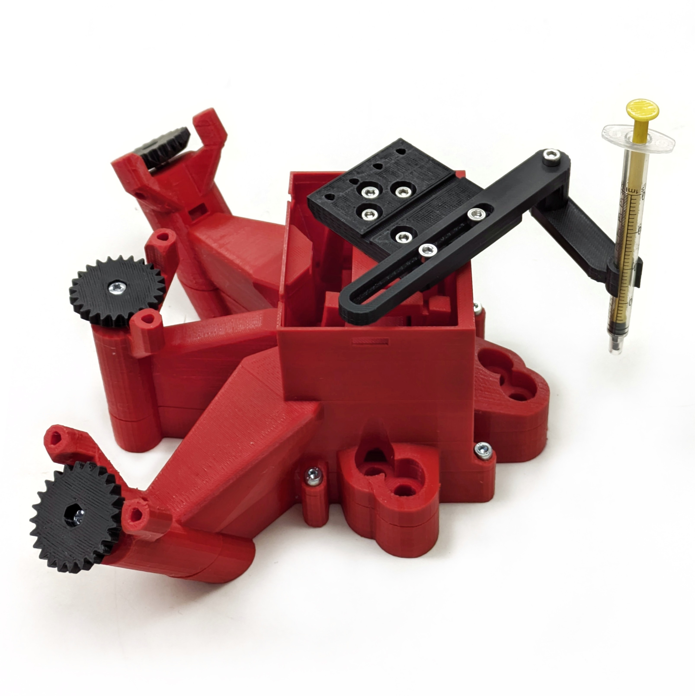

__OpenFlexure Block Stage for SPIM__
================

Fork of [OpenFlexure Block Stage](https://gitlab.com/openflexure/openflexure-block-stage/) project.

Modification of the original Block Stage for SPIM imaging.

Department of Molecular Biophysics, Bogomoletz Institute of Physiology of NAS of Ukraine (Kyiv, Ukraine).

---

# System overview

## Travel distances enlargement

The original OpenFlexure Block stage has only ~2 mm travel distances in each direction, which is not enough for large sample imaging. So, due to the parametric nature of the OpenFlexure Block Stage model, I just adjusted several variables in the `parameters.scad` file to obtain an STL model of the stage with enlarged travel distances.  Additionally, I established a new variable `platform_z_add` which was just a constant in `platform_z` calculation (line 80) to control base high.

I am listing the changed parameters below, travel distances for the final version are ~6 mm across the XY axes and ~3 mm across the Z axis:

| Variable               | Original value | Adjusted value |
| ---------------------- | -------------- | -------------- |
| `beam_height`          | 75             | 100            |
| `stage_to_beam_height` | 12.5           | 0              |
| `xy_lever`             | 10             | 30             |
| `flex_a`               | 0.1            | 0.2            |
| `platform_z_add`       | 7              | 20             |

Good practice for sample fixation during SPIM imaging is embedding the sample in agarose gel. 1 ml syringes are very suitable for large samples, so I designed a "lego figure hand"-like holder for a standard 1 ml insulin syringe. 

> [!TIP]
>
> Read about [sample preparation for SPIM](https://openspim.org/Sample_Preparation).

 Sample holder model V0 | Block Stage top view   | Block Stage side view 
:-------------------------:|:-------------------------:|:-------------------------:
| | 

## R-axis arm
Moving platform modification with additional rotary axis.

_in progress_