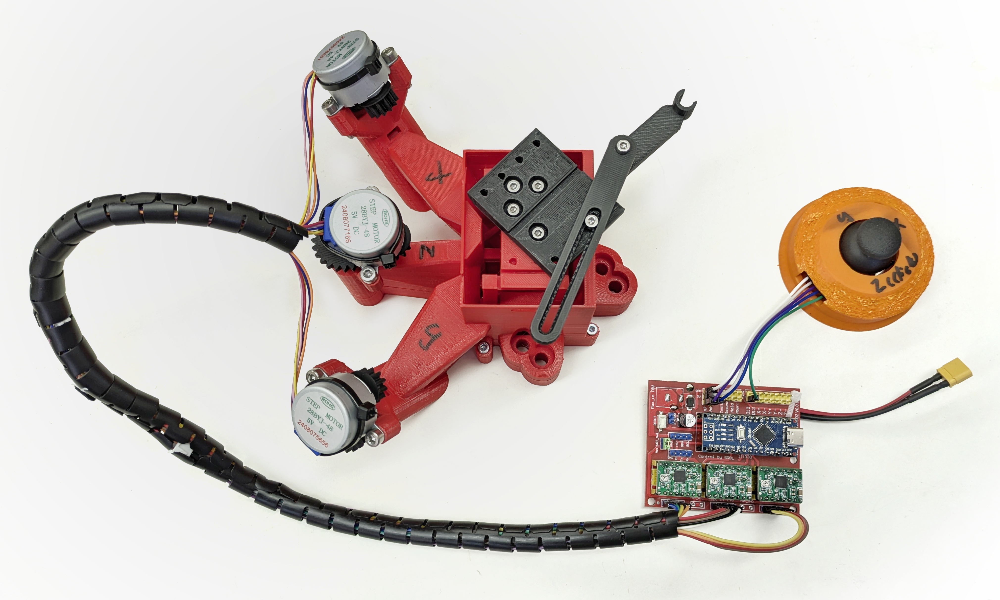

OpenFlexure Block Stage for SPIM
============================

Fork of [OpenFlexure Block Stage](https://gitlab.com/openflexure/openflexure-block-stage/) project.

Modification of the original Block Stage for SPIM imaging.

Department of Molecular Biophysics, Bogomoletz Institute of Physiology of NAS of Ukraine (Kyiv, Ukraine).

---

# Setup overview

Part|#|Cost/unit|Link
-|-|-|-
OpenFlexure Block Stage | 1x | $11 |-
Arduino Nano compatible board | 1x | $2.13 | [AliExpress](https://a.aliexpress.com/_EwrjzyD) 
Arduino Nano CNC board | 1x | $2.8 | [arduino.ua](https://arduino.ua/prod1745-modyl-3d-printera-v-3-0) 
Stepper driver A4988 | 3x | $1.3 | [arduino.ua](https://arduino.ua/prod965-draiver-shagovogo-dvigatelya-stepstick-a4988) 
Stepper drive 28BYJ-48, 5V | 3x | $1.45 | [arduino.ua](https://arduino.ua/prod216-shagovii-dvigatel-5v-28byj-48) 
Joystick module | 1x | $0.75 | [arduino.ua](https://arduino.ua/prod194-djoistik-dlya-arduino) 
Mini560 Pro Step Down to 5V | 1x | $0.85 | [AliExpress](https://a.aliexpress.com/_EJQFP5x) 
XT30 connector | 1x | $0.6 | [arduino.ua](https://arduino.ua/prod5276-xt30-konnektor-para-dlya-podklucheniya-li-po-li-ion-akkymylyatorov) 
30 cm Dupont jumpers kit | 1x | $0.95 | [arduino.ua](https://arduino.ua/prod2334-pepermichki-mama-papa-300mm) 
10 mm Spiral cable organizer | 1x | $2.60 | [AliExpress](https://a.aliexpress.com/_EIXyu5w) 
__Total__ |  | __~$30__ |

# Travel distances enlargement
## Modification V0
The original OpenFlexure Block stage has only ~2 mm travel distances in each direction, which is not enough for large sample imaging. So, due to the parametric nature of the OpenFlexure Block Stage model, I just adjusted several variables in the `parameters.scad` file to obtain an STL model of the stage with enlarged travel distances.  Additionally, I established a new variable `platform_z_add` which was just a constant in `platform_z` calculation (line 80) to control base high.

I am listing the changed parameters below:

| Variable               | Original value | Adjusted value |
| ---------------------- | -------------- | -------------- |
| `beam_height`          | 75             | 100            |
| `stage_to_beam_height` | 12.5           | 0              |
| `xy_lever`             | 10             | 30             |
| `flex_a`               | 0.1            | 0.2            |
| `platform_z_add`       | 7              | 20             |

Sample movement parameters:
- `xy_reduction`=  50 / `xy_lever` = 50/30 = 1.6
- `z_reducion` =  50 / `z_lever` = 50/10 = 5
- M3 screw pitch 0.5 mm

With selected parameters, we achieve next characteristics:

| Axis | Travel distance | Travel per screw revolution (estimated) |
| ---- | --------------- | --------------------------------------- |
| X    | ~6 mm           | 0.313 mm                                |
| Y    | ~6 mm           | 0.313 mm                                |
| Z    | ~3 mm           | 0.1 mm                                  |

__Materials:__

| Part                 | #      | Cost/unit | Link                                                         |
| -------------------- | ------ | --------- | ------------------------------------------------------------ |
| 1.75 mm PLA filament | ~200 g | ~$4.75    | [Monofilament](https://monofilament.com.ua/ua/products/standartnye-materialy/pla/pla-cvetlo-seryj-o1-75mm-ves0-75kg) |
| Silicone O-ring kit  | 1x     | $4.05     | [AliExpress](https://a.aliexpress.com/_EQdsBUy)              |
| 35 mm M3 screw       | 3x     | ~$0.5     | Metalvis                                                     |
| M3 nut               | 6x     | ~$0.25    | Metalvis                                                     |
| __Total__            |        | __~$11__  |                                                              |

# Setup configurations
## Stand-alone joystick control
Simple single speed stage control with joystick, sketch `arduino/cnc_board_joystick_xyz.ino`. Stage works in two modes, XY movement and Z movement, switching between them with joystick click button.

Stepper speed set up at 15 RPM, which achiwed travel speed 0.08 mm/s for XY axes and 0.025 mm/s for Z axis. Minimum rotation value set at 10 degrees per joystick activation. 

Estimated movement parameters:
- ~9 um per joystick activation for XY axes 
- ~3 um per joystick activation for Z axis

[Joystick module case](https://www.printables.com/model/653949-joystick-module-case) model avaliables on Printables (© @ZbychuM_510985).

## μManager control
3-axis stage control with [MarzhauserLStep](https://micro-manager.org/MarzhauserLStep) device adapter, Inspired by [CustomArduino](https://micro-manager.org/CustomArduino) vLStep Z-Axis solution.

# Hardware modifications
## Simple sample holder
Good practice for sample fixation during SPIM imaging is embedding the sample in agarose gel. 1 ml syringes are very suitable for large samples, so I designed a "lego figure hand"-like holder for a standard 1 ml insulin syringe. 

> [!TIP]
>
> Read about [sample preparation for SPIM](https://openspim.org/Sample_Preparation).

 Sample holder model V0 | Block Stage top view   | Block Stage side view 
:-------------------------:|:-------------------------:|:-------------------------:
||

## R-axis arm
Moving platform modification with additional rotary axis.

_in progress_